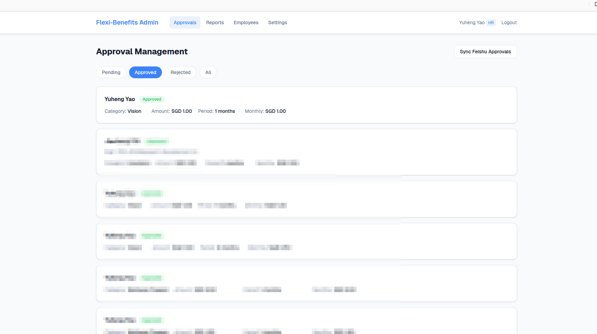
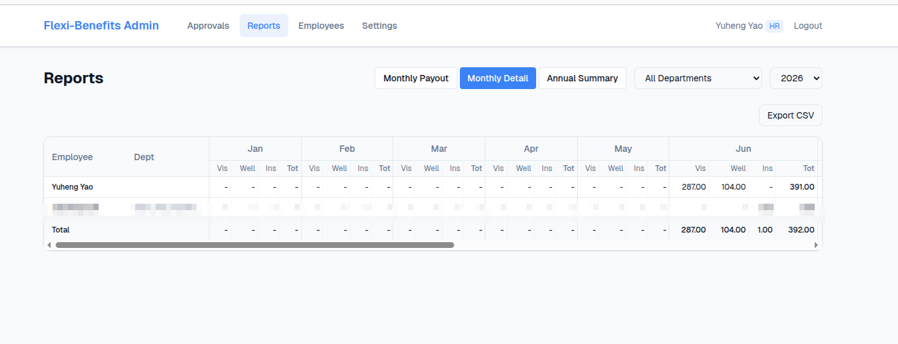
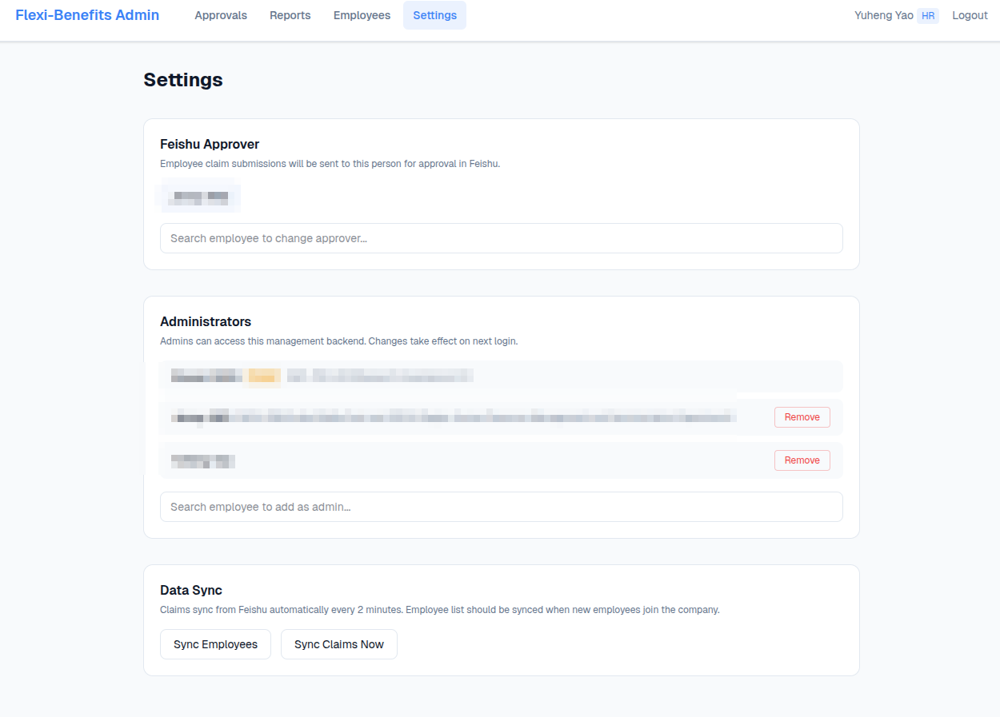

# Flexi-Benefits Claim System

A web-based HR management backend for employee flexi-benefits reimbursement, integrated with Feishu (Lark) ecosystem.

Replaces the legacy Feishu Bitable + workflow approach with a dedicated admin panel while keeping the employee experience on Feishu unchanged.

## Architecture

```
Employees (any network)
  └→ Feishu APP → Submit "Flexi-Benefits Claim" approval → Sent to designated HR

HR Approver (Feishu)
  └→ Feishu APP → Approve / Reject

Intranet Server
  ┌─────────────────────────────────────────────┐
  │  Nginx (HTTPS, self-signed cert)            │
  │    └→ Next.js App                           │
  │         ├→ PostgreSQL                        │
  │         ├→ Feishu API (approval, Bitable)    │
  │         └→ Poller (sync every 2 min)         │
  └─────────────────────────────────────────────┘
  HR browser → https://<server-ip>:8443
```

**Key design decisions:**
- Employees never access the web app — they submit claims via Feishu's built-in approval form
- Web backend is HR-only, deployed on intranet with self-signed HTTPS
- Approval status syncs bidirectionally: Feishu ↔ Web (approve/reject on either side)
- Approver is configurable via Settings page (no Feishu admin access needed)

## Screenshots

### Approval Management
View and manage all employee claims. Filter by status, approve/reject with Feishu sync.



### Monthly Detail Report
Wide table with per-month, per-category breakdown. Department filter + CSV export.



### Settings
Configure Feishu approver, manage administrators, sync employee data.



## Features

### HR Admin Backend
- **Approvals** — View/filter claims, approve/reject (syncs back to Feishu)
- **Reports** — 3 views: Monthly Payout, Monthly Detail, Annual Summary. Department filter + CSV export
- **Employees** — List with Feishu Bitable sync
- **Settings** — Feishu approver management, admin RBAC, data sync

### Feishu Integration
- **OAuth Login** — HR signs in with Feishu account
- **Approval Flow** — Claims submitted in Feishu, routed to designated HR approver
- **Bidirectional Sync** — Poller discovers new submissions + status changes every 2 min
- **Bitable Sync** — Employee data (department, hire date) from HR connector table
- **Approver API** — Change the default approver without Feishu admin access

### Business Logic
- Annual cap: **1000 SGD** per employee (prorated for new hires)
- 3 categories: Vision, Wellness Program, Insurance (shared cap)
- Monthly payout: amount split from approval month to year-end (past months compressed)
- `actually_pay`: accumulated monthly, capped at annual limit

## Tech Stack

| Layer | Technology |
|-------|-----------|
| Frontend | Next.js 16 (App Router), React 19, Tailwind CSS 4 |
| Backend | Next.js API Routes, Node.js 22 |
| ORM | Prisma 7 (with @prisma/adapter-pg) |
| Database | PostgreSQL 16 |
| Auth | Feishu OAuth + JWT (jose) |
| Deploy | Docker Compose, Nginx (self-signed HTTPS) |

## Quick Start

### Local Development

```bash
# 1. Start database
docker compose up -d db

# 2. Install dependencies
npm install

# 3. Configure environment
cp .env.example .env
# Edit .env with your Feishu app credentials

# 4. Database migration
npx prisma migrate dev

# 5. Generate Prisma client
npx prisma generate

# 6. Start dev server
npm run dev
# → http://localhost:3000

# 7. Dev login (bypass OAuth)
# Open http://localhost:3000/api/auth/dev-login
```

### Production Deployment

```bash
# 1. Configure .env (see .env.example)

# 2. Generate HTTPS certificate
./scripts/gen-cert.sh <server-ip> 8443

# 3. Build and start
docker compose --profile production up -d --build

# 4. Add Feishu OAuth redirect URL:
#    https://<server-ip>:8443/api/auth/callback

# 5. Insert initial admin
docker compose exec db psql -U autoclaim -c \
  "INSERT INTO employees (feishu_uid, name_en, is_admin, is_active) VALUES ('ou_xxx', 'Name', true, true);"
```

See [SETUP.md](SETUP.md) for detailed deployment guide and [HANDOVER.md](HANDOVER.md) for full project documentation.

## Project Structure

```
src/
├── app/
│   ├── admin/           # HR management pages
│   │   ├── approvals/   # Claim approval management
│   │   ├── reports/     # Reports (3 views + CSV export)
│   │   ├── employees/   # Employee list + sync
│   │   └── settings/    # Approver, admins, data sync
│   ├── api/             # API routes
│   │   ├── auth/        # OAuth, session, dev-login
│   │   ├── claims/      # CRUD + Feishu sync
│   │   ├── approval/    # Poll + webhook
│   │   ├── admin/       # Employee list, approver config
│   │   ├── sync/        # Bitable employee sync
│   │   └── reports/     # Annual + monthly data
│   └── login/           # Login page
├── lib/
│   ├── auth.ts          # JWT session (admin from DB)
│   ├── calculator.ts    # Payout calculation engine
│   ├── db.ts            # Prisma singleton
│   └── feishu.ts        # Feishu API wrapper
└── instrumentation.ts   # Built-in approval poller
```

## License

Internal use only.
